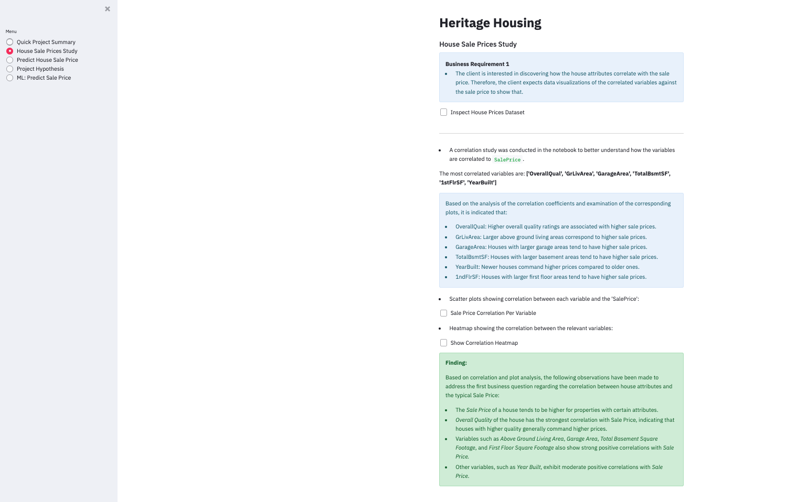
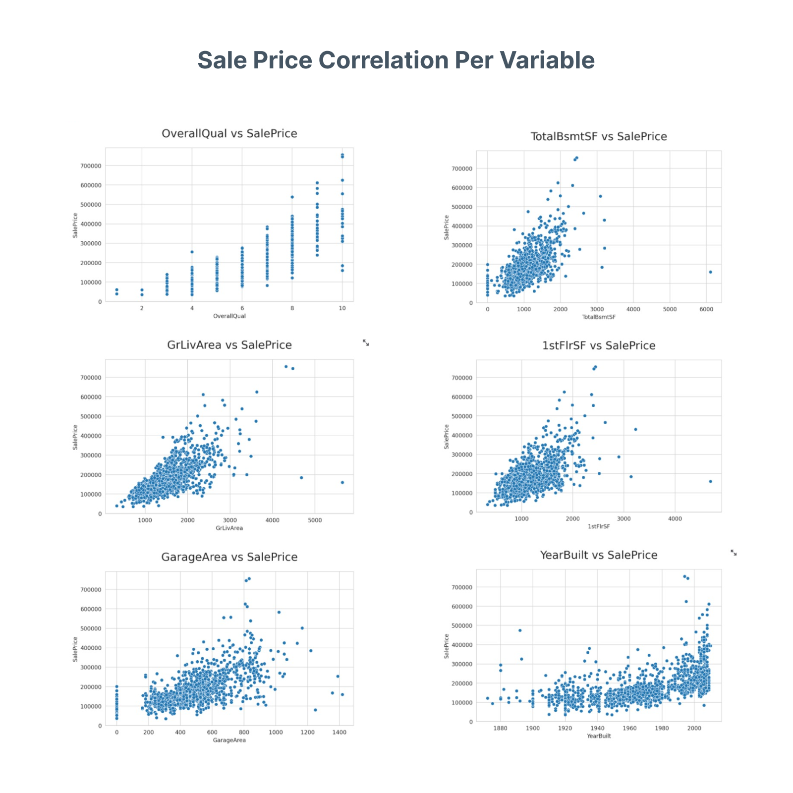
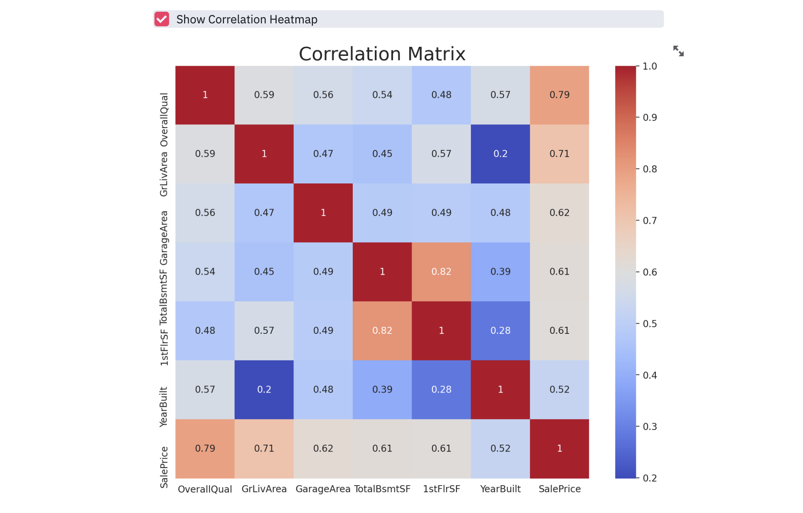
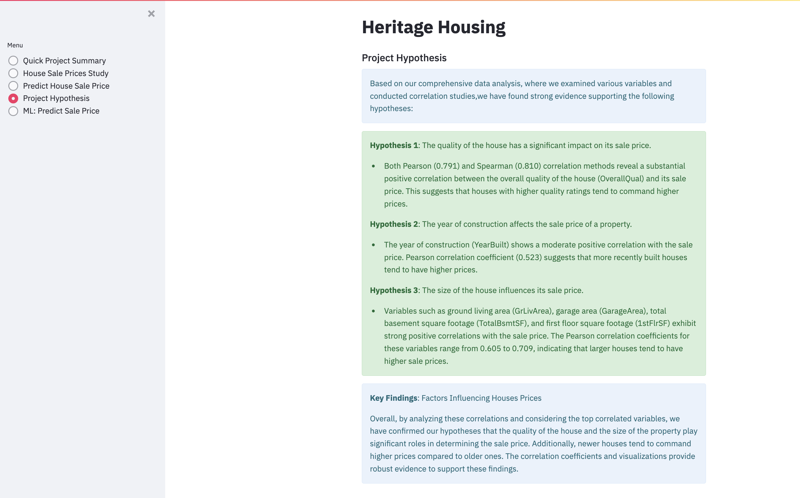
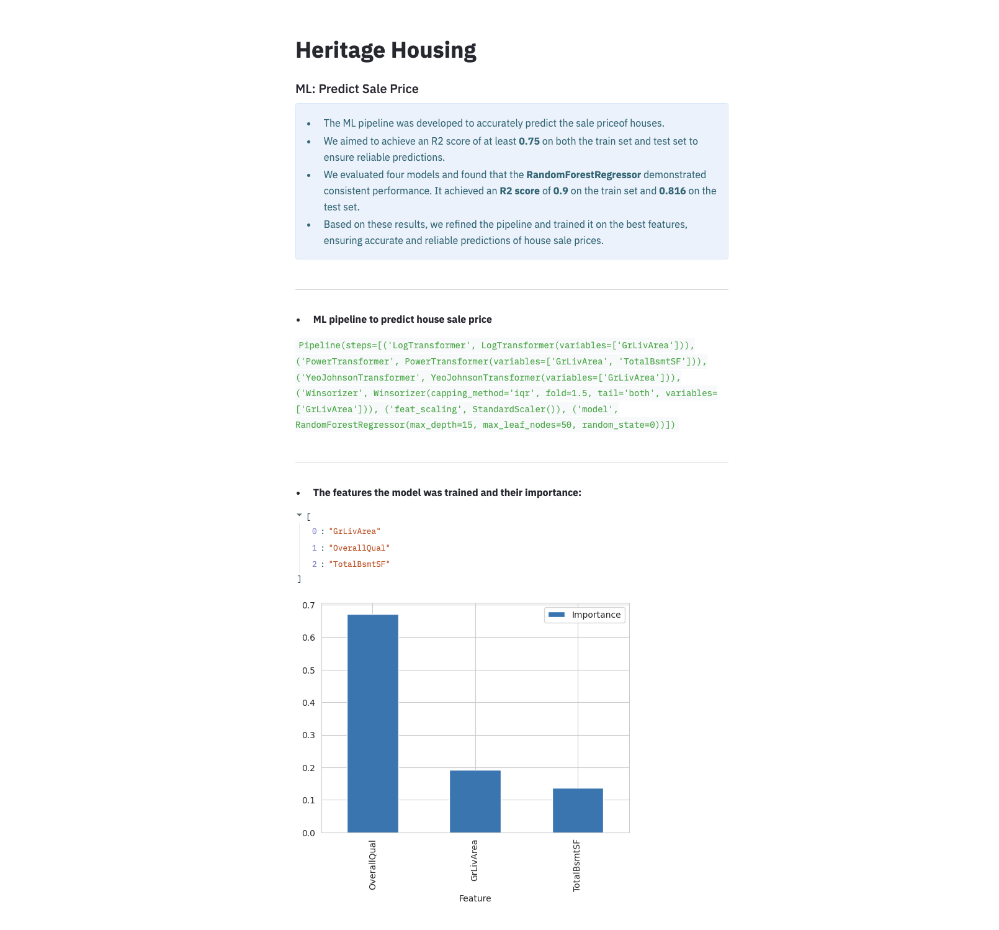
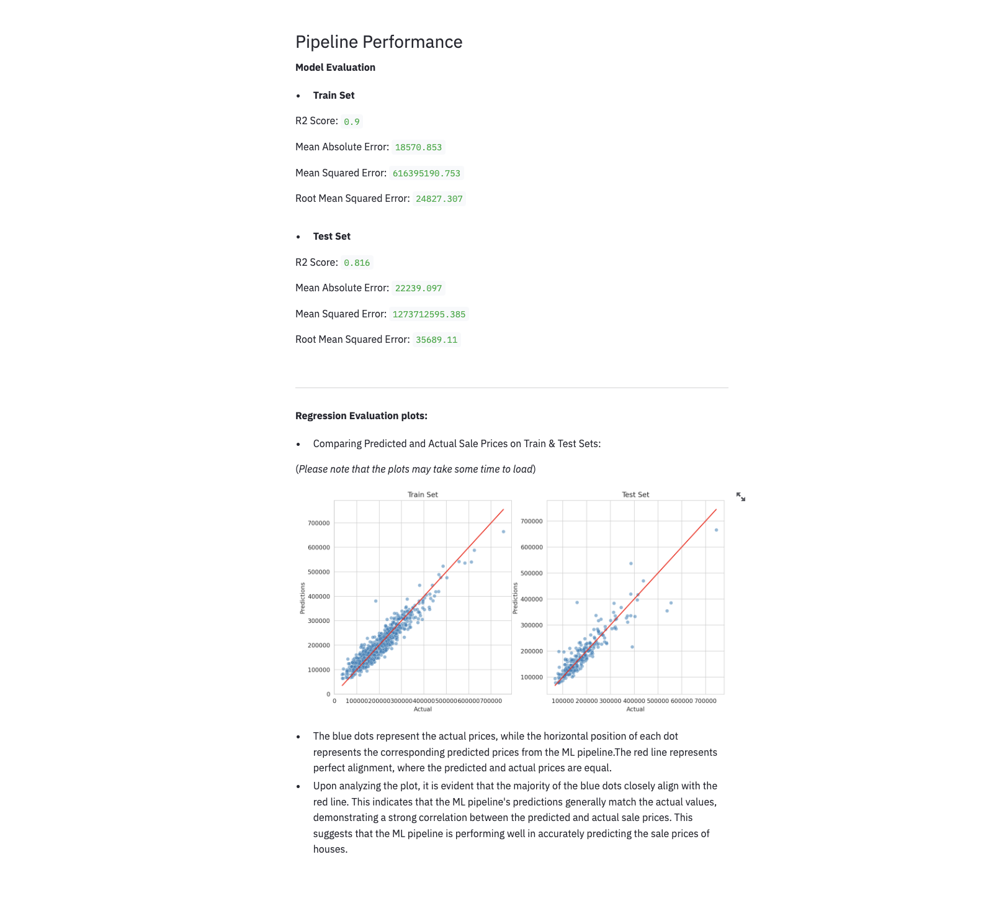
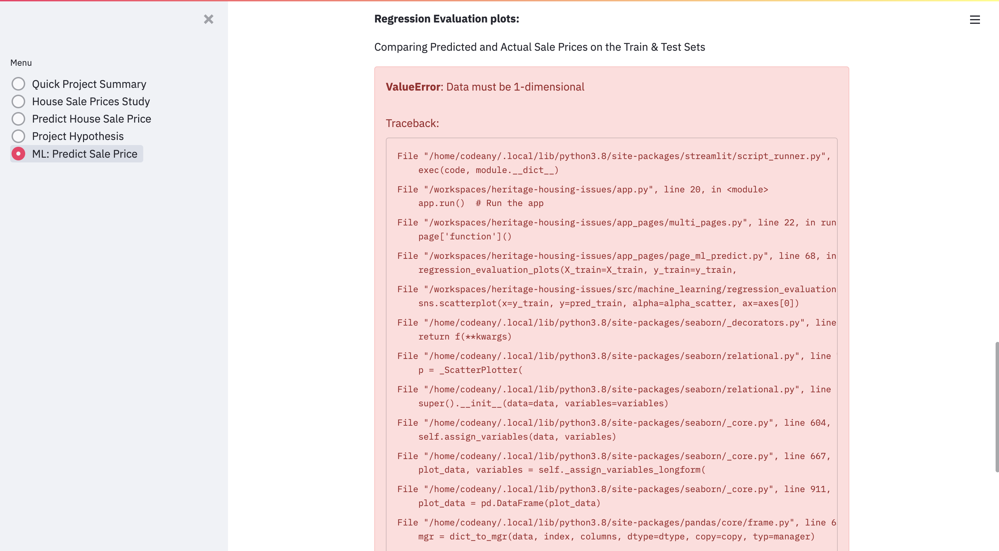
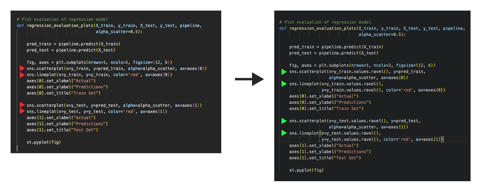

# Heritage Housing Issues

The Heritage Housing Issue project is a machine learning application designed to analyze historical data and relevant features to visualize and predict house prices in Ames, Iowa. The project follows a structured workflow, including data collection, data preparation, model training, and evaluation.

You can find the live link here: [Heritage Housing Issues](https://heritagehousingissues-ed94e76b3412.herokuapp.com/)

---

# Table of contents

- [Dataset Content](#dataset-content)
- [Project Terms and Jargons](#project-terms-and-jargons)
- [Business Requirements](#business-requirements)
- [Project hypothesis and validation](#project-hypothesis-and-validation)
- [User Stories](#user-stories)
- [Rationale to map the business requirements to the Data Visualizations and ML tasks](#rationale-to-map-the-business-requirements-to-the-data-visualizations-and-ml-tasks)
- [ML Business Case](#ml-business-case)
- [Dashboard Design](#dashboard-design)
- [Bugs](#bugs)
- [Deployment](#deployment)
- [Main Data Analysis and Machine Learning Libraries](#main-data-analysis-and-machine-learning-libraries)
- [Credits](#credits)

---

# Dataset Content
* The dataset is sourced from [Kaggle](https://www.kaggle.com/codeinstitute/housing-prices-data). We then created a fictitious user story where predictive analytics can be applied in a real project in the workplace. 
* The dataset has almost 1.5 thousand rows and represents housing records from Ames, Iowa, indicating house profile (Floor Area, Basement, Garage, Kitchen, Lot, Porch, Wood Deck, Year Built) and its respective sale price for houses built between 1872 and 2010.

|Variable|Meaning|Units|
|:----|:----|:----|
|1stFlrSF|First Floor square feet|334 - 4692|
|2ndFlrSF|Second-floor square feet|0 - 2065|
|BedroomAbvGr|Bedrooms above grade (does NOT include basement bedrooms)|0 - 8|
|BsmtExposure|Refers to walkout or garden level walls|Gd: Good Exposure; Av: Average Exposure; Mn: Minimum Exposure; No: No Exposure; None: No Basement|
|BsmtFinType1|Rating of basement finished area|GLQ: Good Living Quarters; ALQ: Average Living Quarters; BLQ: Below Average Living Quarters; Rec: Average Rec Room; LwQ: Low Quality; Unf: Unfinshed; None: No Basement|
|BsmtFinSF1|Type 1 finished square feet|0 - 5644|
|BsmtUnfSF|Unfinished square feet of basement area|0 - 2336|
|TotalBsmtSF|Total square feet of basement area|0 - 6110|
|GarageArea|Size of garage in square feet|0 - 1418|
|GarageFinish|Interior finish of the garage|Fin: Finished; RFn: Rough Finished; Unf: Unfinished; None: No Garage|
|GarageYrBlt|Year garage was built|1900 - 2010|
|GrLivArea|Above grade (ground) living area square feet|334 - 5642|
|KitchenQual|Kitchen quality|Ex: Excellent; Gd: Good; TA: Typical/Average; Fa: Fair; Po: Poor|
|LotArea| Lot size in square feet|1300 - 215245|
|LotFrontage| Linear feet of street connected to property|21 - 313|
|MasVnrArea|Masonry veneer area in square feet|0 - 1600|
|EnclosedPorch|Enclosed porch area in square feet|0 - 286|
|OpenPorchSF|Open porch area in square feet|0 - 547|
|OverallCond|Rates the overall condition of the house|10: Very Excellent; 9: Excellent; 8: Very Good; 7: Good; 6: Above Average; 5: Average; 4: Below Average; 3: Fair; 2: Poor; 1: Very Poor|
|OverallQual|Rates the overall material and finish of the house|10: Very Excellent; 9: Excellent; 8: Very Good; 7: Good; 6: Above Average; 5: Average; 4: Below Average; 3: Fair; 2: Poor; 1: Very Poor|
|WoodDeckSF|Wood deck area in square feet|0 - 736|
|YearBuilt|Original construction date|1872 - 2010|
|YearRemodAdd|Remodel date (same as construction date if no remodelling or additions)|1950 - 2010|
|SalePrice|Sale Price|34900 - 755000|

# Project Terms and Jargons
  - **Variables**: Refers to the different attributes of a house, such as floor area, basement and garage.
  - **Target Variable**: The target variable in this study is the 'SalePrice'. It represents the price at which a house was sold.

# Business Requirements
As a good friend, you are requested by your friend, who has received an inheritance from a deceased great-grandfather located in Ames, Iowa, to  help in maximising the sales price for the inherited properties.

Although your friend has an excellent understanding of property prices in her own state and residential area, she fears that basing her estimates for property worth on her current knowledge might lead to inaccurate appraisals. What makes a house desirable and valuable where she comes from might not be the same in Ames, Iowa. She found a public dataset with house prices for Ames, Iowa, and will provide you with that.

* 1 - The client is interested in discovering how the house attributes correlate with the sale price. Therefore, the client expects data visualisations of the correlated variables against the sale price to show that.
* 2 - The client is interested in predicting the house sale price from her four inherited houses and any other house in Ames, Iowa.

# Project hypothesis and validation
**Hypothesis 1**: The quality of the house has a significant impact on its sale price.
- Both Pearson (0.791) and Spearman (0.810) correlation methods reveal a substantial positive correlation between the overall quality of the house (OverallQual) and its sale price. This suggests that houses with higher quality ratings tend to command higher prices.

**Hypothesis 2**: The year of construction affects the sale price of a property.
- The year of construction (YearBuilt) shows a moderate positive correlation with the sale price. Pearson correlation coefficient (0.523) suggests that more recently built houses tend to have higher prices.

**Hypothesis 3**: The size of the house influences its sale price.
- Variables such as ground living area (GrLivArea), garage area (GarageArea), total basement square footage (TotalBsmtSF), and first floor square footage (1stFlrSF) exhibit strong positive correlations with the sale price. The Pearson correlation coefficients for these variables range from 0.605 to 0.709, indicating that larger houses tend to have higher sale prices.

# User Stories
**Information Gathering and Data Collection**:
- As a Data Practitioner, I want to collect the public dataset on house prices in Ames, Iowa, so that I can gather the necessary data for analysis.
    * How: This will be done by obtaining the data from Kaggle using an API key.

- As a Data Practitioner, I want to gather information on the client's four inherited houses, so that I can include them in the analysis.
    * How: Collect relevant details and attributes of the client's four inherited houses, including features.

**Data Visualization, Cleaning, and Preparation**:
- As a Data Practitioner, I want to visualize the correlated variables against the sale price to identify relationships and potential insights.
    * How: Create visualizations, such as scatter plots or heatmaps, to showcase the correlation between each variable and the sale price.

- As a Data Practitioner, I want to clean and preprocess the data to ensure its quality and suitability for analysis.
    * How: Apply data cleaning techniques to handle missing values, outliers, and inconsistencies in the dataset, ensuring the data is accurate and ready for further analysis.

- As a Data Practitioner, I want to identify the most correlated variables with the sale price so that I can focus on the key factors influencing house prices.
    * How: Calculate and analyze the correlation coefficients between each variable and the sale price, identifying the variables with the highest correlation values.

**Model Training, Optimization, and Validation**:
- As a Data Practitioner, I want to train, optimize, and validate a regression model using the collected data to predict house sale prices accurately.
    * How: Use the cleaned and preprocessed data to train a regression model, optimize its hyperparameters, and evaluate its performance using appropriate metrics.

**Dashboard Planning, Designing, and Development**:
- As a user, I want to have access to an intuitive and user-friendly dashboard, so that I can easily explore the data, visualize predictions, and gain insights.
    * How: The dashboard will be designed with a clean and organized layout, intuitive navigation, and user-friendly interactions.

- As a user, I want the dashboard to incorporate interactive visualizations and predictive capabilities, allowing me to interact with the data and receive accurate predictions.
    * How: The dashboard will be developed using appropriate technologies for interactive visualizations and seamless interaction with the data.

**Dashboard Deployment and Release**:
- As a user, I expect the dashboard to be deployed to a production environment, making it easily accessible for me and other users.
    * How: The dashboard will be deployed to a web server or hosting platform such as Heroku for convenient access through a web browser.

- As a user, I want the dashboard to undergo thorough testing and quality assurance to ensure its functionality and performance.
    * How: The dashboard will be rigorously tested for functionality, responsiveness, and compatibility across different devices and browsers.
    
- As a Data Practitioner, I want to release the dashboard to the client and provide necessary documentation for its usage and maintenance.
    * How: Provide the client with the deployed dashboard, along with clear documentation outlining its usage instructions, features, and any necessary maintenance tasks.

# Rationale to map the business requirements to the Data Visualizations and ML tasks
* ### Business Requirement 1: Correlation Study and Data Visualization
  The client's objective is to gain insights into the factors influencing the sale price of houses.
  - Review and Inspect Dataset: In order to gain a comprehensive understanding of the dataset related to the houses, a thorough review and inspection of the data will be conducted.
  - Correlation Study: To understand how different variables relate to the "SalePrice" of houses, both Pearson and Spearman correlation coefficients will be calculated.
  - Select Most Correlated Variables: Based on the correlation study results, the most highly correlated variables with the "SalePrice" will be identified. These variables will be given priority for further analysis.
  - Data Visualization: Visualizations such as scatter plots, heatmaps, and pair plots will be used to to represent the correlations between each variable and the "SalePrice."
  - Hypothesis Validation: Findings from the correlation study and data visualizations will be used to validate hypotheses about the factors influencing house prices.

* ### Business Requirement 2: Predict House Prices
  The client's objective is to accurately predict house prices in Ames, Iowa. 
  - Data Cleaning and Feature Engineering: To prepare the data for the machine learning model, it is important to clean the data and perform feature engineering.
  - Regression Model Development: A regression model will be constructed using appropriate algorithms (random forest regression) to predict the sale price of houses.
  - Hyperparameter Tuning: To optimize the performance of the regression model, hyperparameters will be adjusted.
  - Regression Evaluation: The trained model will be evaluated using appropriate evaluation metrics such as R2 score (coefficient of determination) and Mean Absolute Error (MAE).
  - Predict house prices: Once the model is trained and evaluated, it can be utilized to predict the prices of four inherited houses and any other house in Ames, Iowa.

# ML Business Case
- Business Requirements:
  * Visualizations: Provide data visualizations showcasing the correlation between house attributes and sale prices.
  * Sale Price Prediction: Enable the prediction of sale prices for the client's inherited houses and any other house in Ames, Iowa.

- Conventional Data Analysis:
  * Conventional data analysis will be utilized to investigate the correlation between house attributes and sale prices.

- Dashboard Requirement:
  * The client requires a dashboard to present the project outcomes.

- Project Outcome:

  The client considers the project successful if it achieves the following outcomes:
    * Relevant Variables: Identify and present the most relevant variables correlated with the sale price.
    * Sale Price Prediction: Develop a model capable of predicting the sale price for the client's four inherited houses and other properties in Ames, Iowa.

- Epics and User Stories:
  * Information Gathering and Data Collection
  * Data Visualization, Cleaning, and Preparation
  * Model Training, Optimization, and Validation
  * Dashboard Planning, Designing, and Development
  * Dashboard Deployment and Release

- Ethical or Privacy Concerns:
  * No ethical or privacy concerns have been identified since the client has obtained the dataset from a public source.

- Model Selection:
  * Based on the available data, a regressor model will be employed to predict the sale price. The regressor will take house attribute information as inputs and generate the predicted sale price as the output.

- Performance Goal:

  To meet the client's expectations, the following performance goal has been set:
    * Achieve an R2 score of at least 0.75 on both the train and test sets.

- Client Benefits:

  The House Price Prediction Dashboard will provide the client with the following benefits:
    * Maximizing Sales Price: By understanding the most relevant variables correlated with sale price, the client can make informed decisions to maximize the sale prices of the inherited properties.

# Dashboard Design

### Page 1: Project Summary

This page is divided into four sections to provide a comprehensive overview of the project.

* Overview and Objectives
    Provides a overview of the ML application and its functionalities.

* Project Terms & Dataset
    Clarifies any specialized terminology or jargon used throughout the project.

* Project Dataset
    Presents a overview of the project dataset, which has been sourced from Kaggle.

* Business Requirements

### Page 2: House Sale Prices Study

This page answers the first business requirement and conducts data analysis on the sale price:

* Dataset Preview
    Clicking on the checkbox will open the table overview of the dataset, displaying its contents.

* Most Correlated Variables
    Identifies the variables that have the highest correlation with the target variable 'SalePrice'.

* Variable Meanings
    Offers descriptions of the meaning and significance of each variable in the dataset.

* General Conclusion
    Summarizes the overall findings and conclusions from the study on house sale prices.

* Interactive Boxes
    Presents interactive scatter plots and heatmaps that users can explore by selecting checkboxes, revealing additional data and insights.

### Page 3: Predict House Sale Price

This page answers the second business requirement and how the analysis meets it. It includes the following elements:

* A table that presents the features of four inherited houses.

* Another table showcasing the best features used for predicting the sale prices, along with the sum of the predicted sale prices for the four inherited houses.

* A intuitive tool with input widgets to predict the sale price of any house in Ames, Iowa, based on the information provided by the user.

### Page 4: Project Hypothesis

This page explores three hypotheses that are directly linked to the objectives of the study.

The process of validation is explained, providing detailed insights into the testing and confirmation of each hypothesis through analysis.

Finally, the page presents the key findings derived from the examination of factors influencing house prices.

### Page 5: ML Predict Sale Price

This page focuses on the performance of the ML model for predicting house sale prices.

* General Conclusion
    Provides a brief summary of the overall performance of the ML model and highlights the main insights derived from the steps described below.

* ML Pipeline
    The steps taken to predict house sale prices using the ML model. This provides insights into the various stages of the pipeline, outlining the processes and techniques employed.

* Feature Importance
    The graphical representation that demonstrates the importance of various features used in training the ML model.

* Pipeline Performance
    Various performance statistics of the ML pipeline which evaluate the accuracy and reliability of the model's predictions.

* Regression Evaluation Plots
    To provide a visual assessment of the ML model's performance, this section presents a plot comparing the predicted sale prices with the actual sale prices.

# Bugs

### ValueError: Data must be 1-dimensional
Description:
* I encountered an issue when attempting to display Regression Evaluation plot in my dashboard. The error message "ValueError: Data must be 1-dimensional" was raised, indicating that there was a problem with the format or shape of the input data.

Solution:
* To resolve this issue, with the help of [stackoverflow](https://stackoverflow.com/questions/67708204/valueerror-data-must-be-1-dimensional) and [javatpoint](https://www.javatpoint.com/flatten-vs-ravel-numpy-functions), I made the following changes to my code:
* I ensured that the `y_train` and `y_test` variables passed to the plotting function were 1-dimensional arrays.
* By applying `.values.ravel()` method on `y_train` and `y_test` to flatten them into a 1-dimensional format before passing them to the function.

# Deployment
### Heroku

* The App live link is: [Heritage Housing Issues](https://heritagehousingissues-ed94e76b3412.herokuapp.com/)
* The project was deployed to Heroku using the following steps.

1. Log in to Heroku and create an App
2. At the Deploy tab, select GitHub as the deployment method.
3. Select your repository name and click Search. Once it is found, click Connect.
4. Select the branch (e.g., main) you want to deploy and click Deploy Branch.
5. Ensure the version of python you are running in runtime.txt is compatible with your app's Heroku stack.
    * Set the runtime.txt Python version to a [Heroku-20](https://devcenter.heroku.com/articles/python-support#supported-runtimes) stack currently supported version.
6. If you need to set the Heroku stack for your app, you can do so by running the following commands in the command line:
    1. Install Heroku by running `pip install heroku`
    2. Login by running `heroku login -i` and entering your login details
    3. Set stack `heroku stack:set <HEROKU-STACK> -a <APP-NAME>`
7. The deployment process should happen smoothly if all deployment files are fully functional.
8. Click the button Open App on the top of the page to access your App.

# Main Data Analysis and Machine Learning Libraries

* Numpy - Used for correlation studies to create and manipulate large arrays for tasks such as generating heatmaps.
* Pandas - Used to convert raw data into data frames, perform operations on datasets, and support data exploration, visualization, and manipulation.
* pandas_profiling - Generated detailed profile reports featuring missing data analysis, distribution analysis, and diverse data visualizations.
* seaborn - Used  to generate various charts, such as correlation histograms, heatmap and feature importance.
* matplotlib - Used to generate various charts and plots to visualize data and present insights.
* Feature-engine - Performed data engineering tasks like encoding categories and numerical transformation for machine learning feature engineering.
* Scikit-Learn - Provided tools to create pipelines and feature selection. It was used to import ML algorithms, assess their performance, and optimize hyperparameters.
* Streamlit - Used to create interactive web app dashboard.

# Credits 

* Code Institute provided the repository [template](https://github.com/Code-Institute-Solutions/milestone-project-heritage-housing-issues).
* The project's dataset is obtained from [Kaggle](https://www.kaggle.com/codeinstitute/housing-prices-data).
* Several custom functions and sections of code have been adapted from the Code Institute's learning materials, specifically the Churnometer walkthrough project.
* This [Tutorial Video](https://www.youtube.com/watch?v=Wqmtf9SA_kk&ab_channel=NeuralNine), along with other videos from the same channel, provided valuable insights and guidance for various aspects of this project.

---

[Back to Top](#)